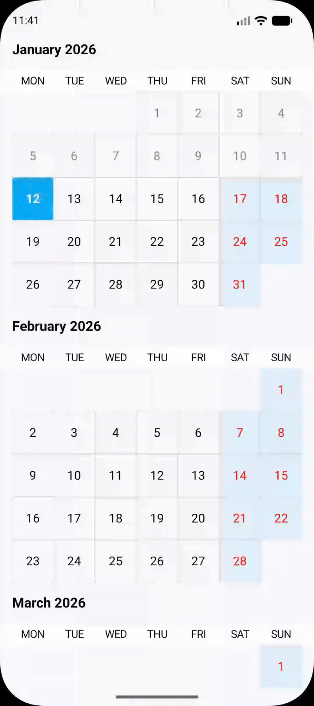

# Draggable DatePicker for Android 📅

A **modern, lightweight, and fully customizable date range picker** for **Jetpack Compose**,
featuring **smooth drag-based date selection**—perfect for travel, booking, and scheduling apps.

Built with performance, flexibility, and Compose best practices in mind.

---

## ✨ Features

- **Draggable Date Range Selection**  
  Select a continuous range of dates with a smooth drag gesture.

- **Jetpack Compose Native**  
  100% built using Jetpack Compose — no XML, no legacy Views.

- **State-Driven API**  
  Clean and predictable state management using `rememberDraggableDateRangePickerState()`.

- **Highly Customizable**  
  Customize year range, colors, typography, cell decorations, and tags.

- **Lightweight & Performant**  
  Minimal dependencies and optimized Canvas drawing for smooth scrolling.

- **Booking App Friendly**  
  Designed for use cases like flights, hotels, and event scheduling.

---

## 📸 Preview

<p align="center">
  
</p>

## 📦 Installation

### 1️⃣ Add JitPack Repository

Add JitPack to your `settings.gradle.kts` file:

```kotlin
dependencyResolutionManagement {
    repositories {
        google()
        mavenCentral()
        maven { url = uri("https://jitpack.io") }
    }
}
```

### 2️⃣ Add Dependency

Add the library to your app-level `build.gradle.kts`:

```kotlin
dependencies {
    implementation("com.github.dev-rahuljangra:draggable-datepicker:<latest-version>")
}
//This is for Java LocalDate.now() support in min Sdk 21
coreLibraryDesugaring("com.android.tools:desugar_jdk_libs:2.1.5")
```

🔗 **Latest version:** [GitHub Repository](https://github.com/dev-rahuljangra/draggable-datepicker)

## 🛠️ Usage

Using the `DraggableDateRangePicker` in your Compose code is simple.
Just remember to use `rememberDraggableDateRangePickerState()` to manage the selection.

- Adding Tags to Dates

You can attach one or more **tags** to specific dates (for example: holidays, prices, events, or
offers).

Tags are applied via the picker state using the `setTags()` API.


```kotlin
@Composable
fun MyDateSelectionScreen() {
    val state = rememberDraggableDateRangePickerState()
      LaunchedEffect(Unit) {
        delay(3000)
    
        state.setTags(
          mapOf(
            LocalDate.of(2026, 1, 1).toEpochDay() to
                    listOf(CalendarTag(text = "New Year"))
          )
        )
      }
    DraggableDateRangePicker(
        state = state,
        startYear = 2026,
        endYear = 2026,
        modifier = Modifier.fillMaxSize()
    )

    // Access selected dates via state.startDate and state.endDate
}
```

## 🎨 Customization

- You can customize the picker to match your app design:

- Year range (startYear, endYear)

- Date cell colors and typography

- Selected range styling

- Tag indicators and alignment

- Disabled / blocked dates (if enabled)

- Detailed theming and styling examples will be added soon.

## 🧩 Common Use Cases

- Flight and hotel booking

- Event scheduling

- Leave management

- Subscription period selection

- Custom calendar-based workflows

## ✍️ Author

**Rahul Jangra** Passionate Android Developer focused on creating beautiful and functional UI components.

- GitHub: [@dev-rahuljangra](https://github.com/dev-rahuljangra)
- LinkedIn: [Rahul Jangra](https://www.linkedin.com/in/dev-rahul-jangra3310/)

## 🤝 Contributing

Contributions are what make the open-source community such an amazing place to learn, inspire, and create. Any contributions you make are **greatly appreciated**.

1. Fork the Project
2. Create your Feature Branch (`git checkout -b feature/AmazingFeature`)
3. Commit your Changes (`git commit -m 'Add some AmazingFeature'`)
4. Push to the Branch (`git push origin feature/AmazingFeature`)
5. Open a Pull Request

---

## ⭐ Support the Project

If you find this library helpful, please consider giving it a **Star** on GitHub. It helps other developers find the project and keeps me motivated to add more features!

## 📄 License

```text
Copyright 2026 Rahul Jangra

Licensed under the Apache License, Version 2.0 (the "License");
you may not use this file except in compliance with the License.
You may obtain a copy of the License at

    http://www.apache.org/licenses/LICENSE-2.0

Unless required by applicable law or agreed to in writing, software
distributed under the License is distributed on an "AS IS" BASIS,
WITHOUT WARRANTIES OR CONDITIONS OF ANY KIND, either express or implied.
See the License for the specific language governing permissions and
limitations under the License.
```
